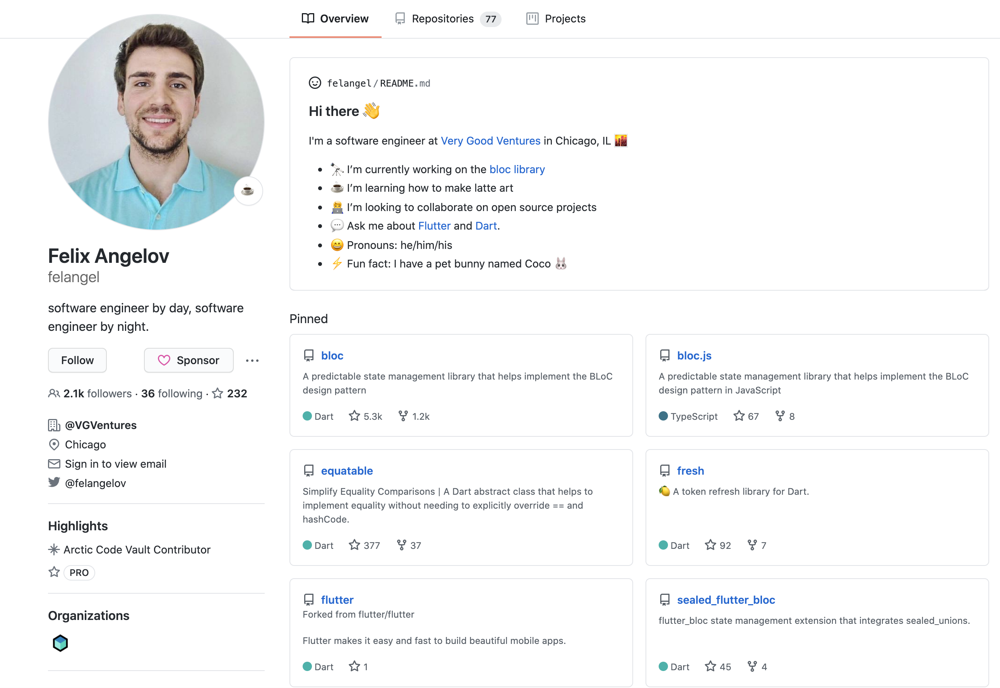

footer: @felangelov - Flutter Vikings 2020
slidenumbers: true

# Cubit and Beyond 🚀

### Still the new kid on the bloc


### Felix Angelov @ Very Good Ventures

---

# Very Good Ventures, Chicago 🕶️🦄



### [https://verygood.ventures](https://verygood.ventures)

---

# Agenda

- Meet Cubit
- Cubit vs. Bloc
- What's new in v6.1.0
- Live Coding

---

# Meet Cubit

> Cubit = Bloc - Events

[.column]


[.column]


---

[.column]

## Cubit


[.column]

## Bloc


---

# CounterCubit

```dart
import 'package:bloc/bloc.dart';

class CounterCubit extends Cubit<int> {
  CounterCubit() : super(0);

  void increment() => emit(state + 1);
}
```

---

# Cubit vs. Bloc

[.column]

**Cubit**

```dart
class CounterCubit extends Cubit<int> {
  CounterCubit() : super(0);

  void increment() => emit(state + 1);
}
```

[.column]

**Bloc**

```dart
enum CounterEvent { increment }

class CounterBloc extends Bloc<CounterEvent, int> {
  CounterBloc() : super(0);

  @override
  Stream<int> mapEventToState(CounterEvent event) async* {
    switch (event) {
      case CounterEvent.increment:
        yield state + 1;
        break;
    }
  }
}
```

---

Cubit vs. Bloc

|                     | Cubit | Bloc |
| ------------------- | :---: | :--: |
| Simple              |  ✅   |      |
| Concise             |  ✅   |      |
| Traceable           |       |  ✅  |
| ReactiveX Operators |       |  ✅  |
| Testable            |  ✅   |  ✅  |
| Scalable            |  ✅   |  ✅  |
| Tooling Support     |  ✅   |  ✅  |

---

# What's New in v6.1.0?

# ✨✨✨

---

# context.watch

```dart
@override
Widget build(BuildContext context) {
  final state = context.watch<MyBloc>().state;
  return Text('$state');
}
```

- Rebuilds when the state of `MyBloc` changes.
- Only allowed directly in `build`.
- Equivalent to top level BlocBuilder.

---

# context.watch basics

```dart
// 😊
@override
Widget build(BuildContext context) {
  return BlocBuilder<MyBloc, MyState>(
    builder: (context, state) => Text('$state'),
  );
}
```

```dart
// 😎
@override
Widget build(BuildContext context) {
  final state = context.watch<MyBloc>().state;
  return Text('$state');
}
```

---

# context.watch gotchas

[.column]

```dart
// 😬
@override
Widget build(BuildContext context) {
  final state = context.watch<MyBloc>().state;
  return Scaffold(
    appBar: ...
    body: Text('$state'),
    floatingActionButton: ...
  );
}
```

[.column]

```dart
// 😎
@override
Widget build(BuildContext context) {
  return Scaffold(
    appBar: ...
    body: Builder(
      builder: (context, state) {
        final state = context.watch<MyBloc>().state;
        return Text('$state');
      },
    ),
    floatingActionButton: ...
  );
}
```

---

# context.watch recap

[.column]

```dart
// BEFORE (bad) 😬
@override
Widget build(BuildContext context) {
  final state = context.bloc<MyBloc>().state;
  return Text('$state');
}
```

[.column]

```dart
// NOW (good) 😊
@override
Widget build(BuildContext context) {
  return BlocBuilder<MyBloc, MyState>(
    builder: (context, state) => Text('$state'),
  );
}
```

```dart
// NOW (good) 😎
@override
Widget build(BuildContext context) {
  final state = context.watch<MyBloc>().state;
  return Text('$state');
}
```

---


---

# MultiBlocBuilder?

# 🥁🥁🥁


---

# MultiBlocBuilder 🎉 (sort of)

```dart
Builder(
  builder: (context) {
    final stateA = context.watch<BlocA>().state;
    final stateB = context.watch<BlocB>().state;
    final stateC = context.watch<BlocC>().state;

    // return a Widget which depends on the state of BlocA, BlocB, and BlocC
  }
);
```

---

# context.read

```dart
@override
Widget build(BuildContext context) {
  return RaisedButton(
    onPressed: () {
      context.read<MyBloc>().add(MyEvent());
    },
    ...
  )
}
```

- Does not rebuild when the state of `MyBloc` changes.
- Not allowed directly in `build`.

---

# context.read recap

[.column]

```dart
// BEFORE (bad) 😬
@override
Widget build(BuildContext context) {
  final bloc = context.bloc<MyBloc>();
  return RaisedButton(
    onPressed: () {
      bloc.add(MyEvent());
    },
    ...
  )
}
```

[.column]

```dart
// NOW 😎
@override
Widget build(BuildContext context) {
  return RaisedButton(
    onPressed: () {
      context.read<MyBloc>().add(MyEvent());
    },
    ...
  )
}
```

---

# context.select

```dart
@override
Widget build(BuildContext context) {
  final name = context.select(
    (UserBloc bloc) => bloc.state.user.name,
  );
  return Text('Hello $name!');
}
```

- Rebuild in response to part of a bloc's state.

---

# Decision Tree


---

# Bloc Test Scenario

```dart
blocTest<CounterBloc, int>(
  'emits 100 when increment is called and state is 99',
  build: () => CounterBloc(),
  act: (bloc) {
    bloc
      ..add(CounterEvent.increment)
      ..add(CounterEvent.increment)
      ..add(CounterEvent.increment)
      ..add(CounterEvent.increment)
      ..add(CounterEvent.increment)
      ...
  },
  expect: const <int>[100],
);
```

---

# Bloc Test Seed State

```dart
blocTest<CounterBloc, int>(
  'emits 100 when increment is called and state is 99',
  build: () => CounterBloc(),
  seed: 99,
  act: (bloc) => bloc.add(CounterEvent.increment),
  expect: const <int>[100],
);
```

---

# Complete migration guide

# [https://bloclibrary.dev/#/migration](https://bloclibrary.dev/#/migration)

---

# Live Coding

# 👩‍💻👨‍💻

### https://github.com/felangel/cubit\_and\_beyond/tree/main/example

---

# Thanks! 🙏

## Twitter @felangelov

## Github @felangel
